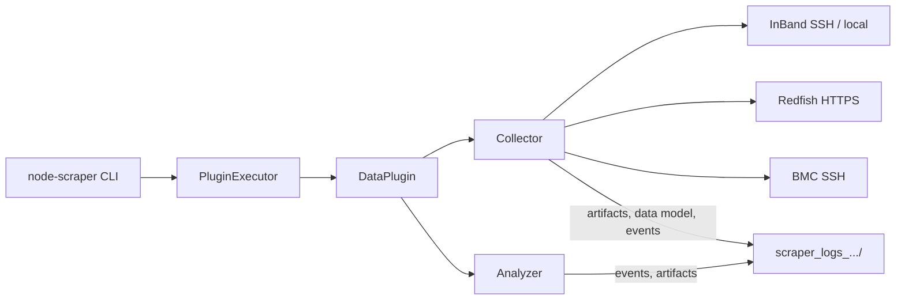

# Node Scraper

Node Scraper performs automated data collection and analysis for system debug. Plugins collect data from the host OS (in-band) or BMC (out-of-band via Redfish or SSH), run analyzers, and emit events and logs.

## Quick links

| Topic | Document |
| --- | --- |
| **Documentation index** | [docs/README.md](docs/README.md) |
| **Architecture (CLI → plugins → connections → events)** | [docs/architecture/overview.md](docs/architecture/overview.md) |
| **CLI subcommands** | [docs/cli/subcommands.md](docs/cli/subcommands.md) |
| **Plugin & run configs** | [docs/cli/configs.md](docs/cli/configs.md) |
| **In-band / OOB connections** | [docs/connections/overview.md](docs/connections/overview.md) |
| **Connection config JSON** | [docs/connections/connection-config.md](docs/connections/connection-config.md) |
| **All plugins (generated reference)** | [docs/PLUGIN_DOC.md](docs/PLUGIN_DOC.md) |
| **Extending & external plugins** | [EXTENDING.md](EXTENDING.md) |
| **ServiceabilityPluginMI3XX** | [docs/plugins/serviceability-mi3xx.md](docs/plugins/serviceability-mi3xx.md) |

## Architecture at a glance



Collection writes raw artifacts to disk (command output, Redfish JSON, log files) even when no analyzer runs. Analysis adds events and may append more artifacts.

More detail: [docs/architecture/overview.md](docs/architecture/overview.md).

## Installation

### PyPI

Requires Python 3.9+.

```sh
pip install amd-node-scraper
node-scraper --help
```

Published on [PyPI](https://pypi.org/project/amd-node-scraper/) as **amd-node-scraper**.

### From source

```sh
source dev-setup.sh
```

Or manually:

```sh
python3 -m venv venv
source venv/bin/activate
python3 -m pip install --editable .[dev] --upgrade
pre-commit install   # optional
```

## Quick start

**Local in-band plugin:**

```sh
node-scraper run-plugins DmesgPlugin
```

**Remote host (SSH):**

```sh
node-scraper --sys-location REMOTE --connection-config connection_config.json \
  run-plugins DmesgPlugin
```

**OOB Redfish plugin:**

```sh
node-scraper --connection-config connection-config.json \
  run-plugins RedfishEndpointPlugin
```

Connection JSON examples: [docs/connections/connection-config.md](docs/connections/connection-config.md).

## CLI help

<!-- node-scraper -h start -->
```sh
usage: cli.py [-h] [--version] [--sys-name STRING]
              [--sys-location {LOCAL,REMOTE}]
              [--sys-interaction-level {PASSIVE,INTERACTIVE,DISRUPTIVE}]
              [--sys-sku STRING] [--sys-platform STRING]
              [--plugin-configs LIST] [--system-config STRING]
              [--connection-config STRING] [--log-path STRING]
              [--log-level {CRITICAL,FATAL,ERROR,WARN,WARNING,INFO,DEBUG,NOTSET}]
              [--no-console-log] [--gen-reference-config] [--skip-sudo]
              {summary,run-plugins,describe,gen-plugin-config,compare-runs,show-redfish-oem-allowable}
              ...

node scraper CLI

positional arguments:
  {summary,run-plugins,describe,gen-plugin-config,compare-runs,show-redfish-oem-allowable}
                        Subcommands
    summary             Generates summary csv file
    run-plugins         Run a series of plugins
    describe            Display details on a built-in config or plugin
    gen-plugin-config   Generate a config for a plugin or list of plugins
    compare-runs        Compare datamodels from two run log directories
    show-redfish-oem-allowable
                        Fetch OEM diagnostic allowable types from Redfish
                        LogService (for oem_diagnostic_types_allowable)

options:
  -h, --help            show this help message and exit
  --version             show program's version number and exit
  --sys-name STRING     System name (default: <current hostname>)
  --sys-location {LOCAL,REMOTE}
                        Location of target system (default: LOCAL)
  --sys-interaction-level {PASSIVE,INTERACTIVE,DISRUPTIVE}
                        Specify system interaction level, used to determine
                        the type of actions that plugins can perform (default:
                        INTERACTIVE)
  --sys-sku STRING      Manually specify SKU of system (default: None)
  --sys-platform STRING
                        Specify system platform (default: None)
  --plugin-configs LIST
                        Comma-separated built-in names and/or plugin config
                        JSON paths (e.g. --plugin-
                        configs=NodeStatus,/path/c.json). Built-ins:
                        AllPlugins, NodeStatus (default: None)
  --system-config STRING
                        Path to system config json (default: None)
  --connection-config STRING
                        Path to connection config json (default: None)
  --log-path STRING     Specifies local path for node scraper logs, use 'None'
                        to disable logging (default: .)
  --log-level {CRITICAL,FATAL,ERROR,WARN,WARNING,INFO,DEBUG,NOTSET}
                        Change python log level (default: INFO)
  --no-console-log      Write logs only to nodescraper.log under the run
                        directory; do not print to stdout. If no run log
                        directory would be created (e.g. --log-path None),
                        uses ./scraper_logs_<host>_<timestamp>/ like the
                        default layout. (default: False)
  --gen-reference-config
                        Generate reference config from system. Writes to
                        ./reference_config.json. (default: False)
  --skip-sudo           Skip plugins that require sudo permissions (default:
                        False)
```
<!-- node-scraper -h end -->

Full subcommand reference: [docs/cli/subcommands.md](docs/cli/subcommands.md).

## Execution modes

| Mode | Flag | Description |
| --- | --- | --- |
| Local | `--sys-location LOCAL` (default) | Run on the machine where Node Scraper is installed |
| Remote | `--sys-location REMOTE` | SSH to target host via `InBandConnectionManager` in `--connection-config` |

OOB plugins use `RedfishConnectionManager` in `--connection-config` regardless of `sys-location`.

## Logs

Default layout: `./scraper_logs_<host>_<timestamp>/` with per-plugin artifacts, `events.json`, and `nodescraper.csv`. Override with `--log-path`.

See [docs/architecture/events-and-results.md](docs/architecture/events-and-results.md).
