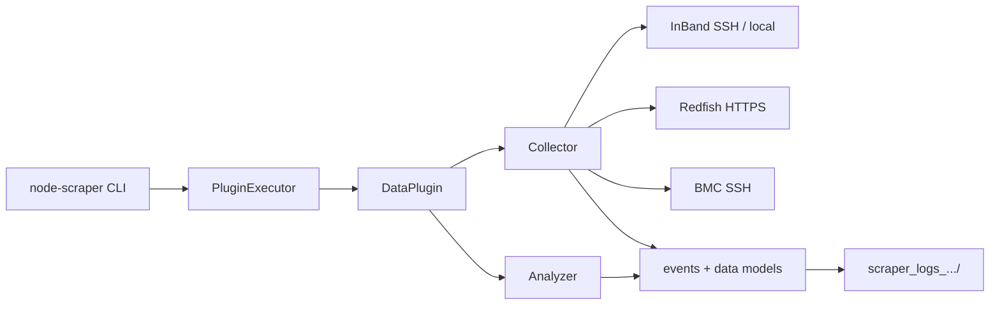

# Node Scraper

Node Scraper performs automated data collection and analysis for system debug. Plugins collect data from the host OS (in-band) or BMC (out-of-band via Redfish or SSH), run analyzers, and emit events and logs.

## Quick links

| Topic | Document |
| --- | --- |
| **Documentation index** | [docs/README.md](docs/README.md) |
| **Architecture (CLI → plugins → connections → events)** | [docs/architecture/overview.md](docs/architecture/overview.md) |
| **CLI subcommands** | [docs/cli/subcommands.md](docs/cli/subcommands.md) |
| **Plugin & run configs** | [docs/cli/configs.md](docs/cli/configs.md) |
| **In-band / OOB connections** | [docs/connections/overview.md](docs/connections/overview.md) |
| **Connection config JSON** | [docs/connections/connection-config.md](docs/connections/connection-config.md) |
| **All plugins (generated reference)** | [docs/PLUGIN_DOC.md](docs/PLUGIN_DOC.md) |
| **Extending & external plugins** | [EXTENDING.md](EXTENDING.md) |
| **Serviceability plugin** | [README_SERVICEABILITY.md](README_SERVICEABILITY.md) |

## Architecture at a glance



Details, sequence diagrams, and source file map: [docs/architecture/overview.md](docs/architecture/overview.md).

## Installation

### PyPI

Requires Python 3.9+.

```sh
pip install amd-node-scraper
node-scraper --help
```

Published on [PyPI](https://pypi.org/project/amd-node-scraper/) as **amd-node-scraper**.

### From source

```sh
source dev-setup.sh
```

Or manually:

```sh
python3 -m venv venv
source venv/bin/activate
python3 -m pip install --editable .[dev] --upgrade
pre-commit install   # optional
```

## Quick start

**Local in-band plugin:**

```sh
node-scraper run-plugins DmesgPlugin
```

**Remote host (SSH):**

```sh
node-scraper --sys-location REMOTE --connection-config connection_config.json \
  run-plugins DmesgPlugin
```

**OOB Redfish plugin:**

```sh
node-scraper --connection-config connection-config.json \
  run-plugins RedfishEndpointPlugin
```

Connection JSON examples: [docs/connections/connection-config.md](docs/connections/connection-config.md).

## CLI help

<!-- node-scraper -h start -->
```sh
usage: cli.py [-h] [--version] [--sys-name STRING]
              [--sys-location {LOCAL,REMOTE}]
              [--sys-interaction-level {PASSIVE,INTERACTIVE,DISRUPTIVE}]
              [--plugin-configs LIST] [--connection-config STRING]
              [--log-path STRING] ...
              {summary,run-plugins,describe,gen-plugin-config,compare-runs,show-redfish-oem-allowable}
              ...

Subcommands: summary | run-plugins | describe | gen-plugin-config | compare-runs | show-redfish-oem-allowable
```
<!-- node-scraper -h end -->

Full subcommand reference: [docs/cli/subcommands.md](docs/cli/subcommands.md).

## Execution modes

| Mode | Flag | Description |
| --- | --- | --- |
| Local | `--sys-location LOCAL` (default) | Run on the machine where Node Scraper is installed |
| Remote | `--sys-location REMOTE` | SSH to target host via `InBandConnectionManager` in `--connection-config` |

OOB plugins use `RedfishConnectionManager` in `--connection-config` regardless of `sys-location`.

## Logs

Default layout: `./scraper_logs_<host>_<timestamp>/` with per-plugin artifacts, `events.json`, and `nodescraper.csv`. Override with `--log-path`.

See [docs/architecture/events-and-results.md](docs/architecture/events-and-results.md).
