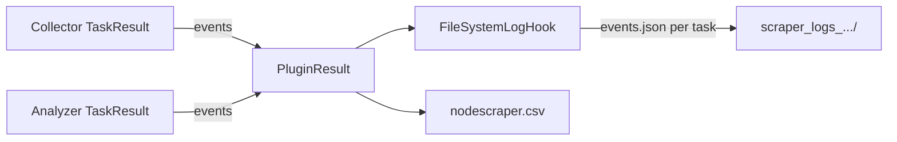

# Events and results

Node Scraper reports findings as **events** attached to collector and analyzer task results. Events are merged into plugin results and persisted under the run log directory.

## Event model

Each event is an `Event` (`nodescraper/models/event.py`) with:

- **reporter** — plugin or task name
- **category** — e.g. hardware, software (see `EventCategory`)
- **description** — human-readable message
- **priority** — severity (see `EventPriority`)
- **metadata** — task name, parent, session id

Plugins pass `max_event_priority_level` into `run()` to cap how severe an event may be logged.

## Where events are created

| Source | Mechanism |
| --- | --- |
| Task base class | `Task._build_event()` / `Task._log_event()` on validation or connection errors |
| Collectors / analyzers | Decorators on `collect_data` / `analyze_data` |
| Regex analyzers | `RegexAnalyzer` → `RegexEvent` on pattern match |
| Check analyzers | Threshold / JSON checks (memory, Redfish endpoint, etc.) |
| Serviceability | AFID events from Redfish log parsing (`afid_events.py`) |

## Result flow



1. **Collection** — `DataPlugin.collect()` runs `COLLECTOR.collect_data()`. Collector events append to `collection_result.events`.

2. **Analysis** — `DataPlugin.analyze()` runs `ANALYZER.analyze_data()`. Analyzer events append to `analysis_result.events`.

3. **Plugin result** — `PluginResult` wraps collection and analysis `TaskResult`s plus status.

4. **Persistence** — `FileSystemLogHook` writes per-task `events.json` and data model JSON under:

   ```
   scraper_logs_<host>_<timestamp>/
     <plugin_name>/
       <collector_or_analyzer>/
         events.json
         ...
   ```

5. **Summary** — `TableSummary` collator prints a table to the console; `nodescraper.csv` aggregates run status.

## Offline / `--data` mode

Many plugins accept `--data` to skip collection and load a prior data model or raw input file. Analysis still runs and can emit events; no live connection is required when collection is disabled.

## Related

- [overview.md](overview.md) — full pipeline diagram
- [../PLUGIN_DOC.md](../PLUGIN_DOC.md) — per-plugin event behavior
