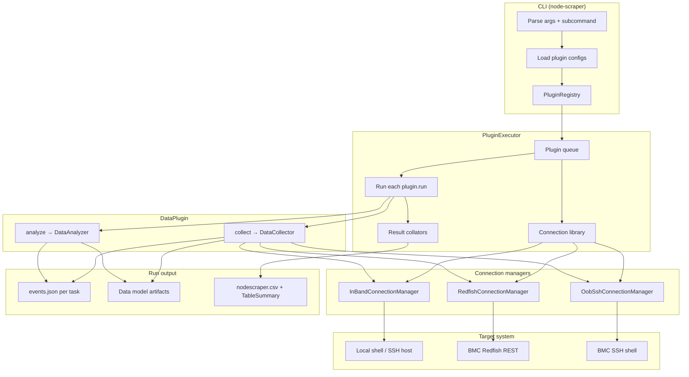
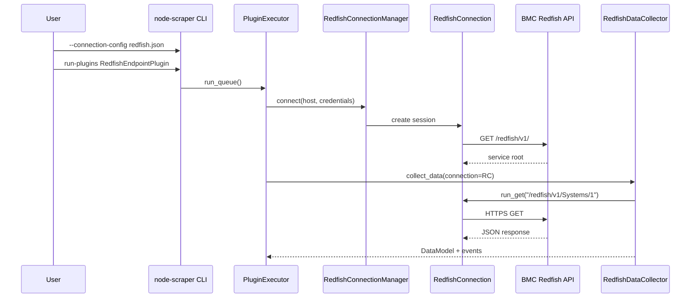

# Architecture overview

Node Scraper collects and analyzes system data through **plugins**. Each plugin runs a **collector** (gather raw data) and optionally an **analyzer** (check data and emit events). The CLI loads configs, builds a plugin queue, connects to the target system, runs plugins, and writes logs.

## High-level flow

## Step-by-step

1. **CLI entry** — `node-scraper` invokes `nodescraper/cli/cli.py::main()`. Global flags set system info, log path, and optional `--connection-config` / `--plugin-configs`.

2. **Plugin discovery** — `PluginRegistry` loads built-in plugins from `nodescraper/plugins/` and external plugins from `[project.entry-points."nodescraper.plugins"]`.

3. **Queue** — `run-plugins` (default subcommand) builds a queue from CLI plugin names and/or JSON plugin configs. `PluginExecutor.run_queue()` runs plugins in order.

4. **Connections** — Each plugin declares a `CONNECTION_TYPE`. The executor resolves a connection manager from `--connection-config` or creates one lazily:
   - **In-band** — `InBandConnectionManager` → local shell or SSH to the host OS.
   - **OOB Redfish** — `RedfishConnectionManager` → HTTPS REST to the BMC (`RedfishConnection.run_get`, paging helpers).
   - **OOB SSH** — `OobSshConnectionManager` (uses Redfish config credentials, SSH to BMC) for BMC-shell plugins.

5. **Collect / analyze** — `DataPlugin.run()` calls `COLLECTOR.collect_data()` then `ANALYZER.analyze_data()`. Collectors receive the live connection object; analyzers work on the in-memory data model.

6. **Events and logs** — Tasks build `Event` objects on failures or rule matches. `FileSystemLogHook` writes `events.json` and data model files under `scraper_logs_<host>_<timestamp>/`. Result collators (default: `TableSummary`) print a summary table.

## In-band vs out-of-band (at a glance)

| Path | Plugin base | Connection | Typical data source |
| --- | --- | --- | --- |
| In-band | `InBandDataPlugin` | `InBandConnectionManager` | dmesg, ROCm, PCIe, packages on the host OS |
| OOB Redfish | `OOBandDataPlugin` | `RedfishConnectionManager` | Redfish GETs, OEM diag, serviceability event logs |
| OOB BMC SSH | `OOBSSHDataPlugin` | `OobSshConnectionManager` | Shell commands on the BMC |

See [connections/overview.md](../connections/overview.md) for connection JSON and Redfish reachability details.

## Key source files

| Area | Path |
| --- | --- |
| CLI | `nodescraper/cli/cli.py`, `nodescraper/cli/invocation.py` |
| Executor | `nodescraper/pluginexecutor.py` |
| Plugin contract | `nodescraper/interfaces/dataplugin.py` |
| In-band base | `nodescraper/base/inbandcollectortask.py` |
| Redfish collector base | `nodescraper/base/redfishcollectortask.py` |
| Redfish HTTP | `nodescraper/connection/redfish/redfish_connection.py` |
| Events | `nodescraper/interfaces/task.py`, `nodescraper/models/event.py` |
| Log hook | `nodescraper/taskresulthooks/filesystemloghook.py` |

## How OOB plugins reach Redfish

Redfish-only subcommands (for example `show-redfish-oem-allowable`) instantiate `RedfishConnection` directly in the CLI without running a full plugin.

## Related docs

- [events-and-results.md](events-and-results.md) — event creation and log layout
- [../cli/subcommands.md](../cli/subcommands.md) — CLI reference
- [../PLUGIN_DOC.md](../PLUGIN_DOC.md) — per-plugin catalog
