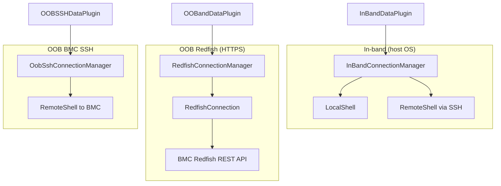

# Connections overview

Node Scraper talks to the target through **connection managers**. Each plugin declares which manager type it needs; the CLI supplies credentials via `--connection-config` (or uses local defaults).

## Three transport paths

| Path | When to use | Plugin base | Config key |
| --- | --- | --- | --- |
| **In-band local** | Node Scraper runs on the target host | `InBandDataPlugin` | None (default `--sys-location LOCAL`) |
| **In-band remote** | SSH to host OS | `InBandDataPlugin` | `InBandConnectionManager` |
| **OOB Redfish** | HTTPS GET/POST to BMC | `OOBandDataPlugin` | `RedfishConnectionManager` |
| **OOB BMC SSH** | Shell on BMC (archive, generic collection) | `OOBSSHDataPlugin` | `RedfishConnectionManager` (credentials reused for SSH) |

## System location

`--sys-location` controls in-band behavior:

- **LOCAL** (default) — in-band plugins run commands on the machine where `node-scraper` is installed.
- **REMOTE** — in-band plugins use SSH using `InBandConnectionManager` in `--connection-config`.

OOB plugins always use the BMC address from `RedfishConnectionManager` regardless of `sys-location`.

## Redfish from plugins

OOB Redfish collectors inherit `RedfishDataCollector` (`nodescraper/base/redfishcollectortask.py`):

- `_run_redfish_get(uri)` — single GET
- `_run_redfish_get_paged(uri)` — follow `Members@odata.nextLink`

The collector receives a connected `RedfishConnection` from `RedfishConnectionManager.connect()`.

Example plugins: `RedfishEndpointPlugin`, `RedfishOemDiagPlugin`, `ServiceabilityPluginMI3XX`, `Mi4xxServiceabilityPlugin`.

## In-band from plugins

In-band collectors inherit `InBandDataCollector`:

- `_run_sut_cmd(cmd)` — run shell command on target
- `_read_sut_file(path)` — read file from target

Example plugins: `DmesgPlugin`, `RocmPlugin`, `PciePlugin`.

## Related

- [connection-config.md](connection-config.md) — JSON examples
- [../plugins/inband.md](../plugins/inband.md) — authoring in-band plugins
- [../plugins/oob.md](../plugins/oob.md) — authoring OOB plugins
- [../architecture/overview.md](../architecture/overview.md) — full CLI flow
